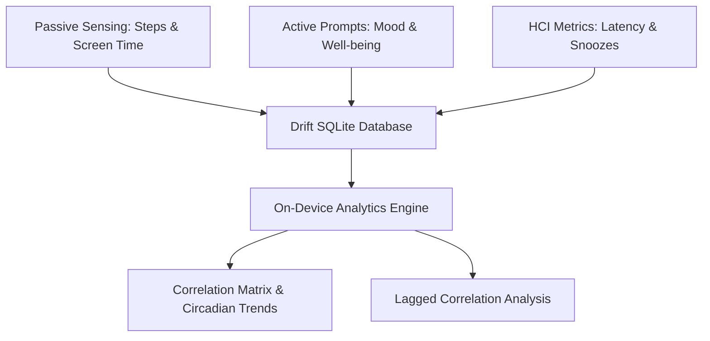

# Covary 

**Covary** is an advanced behavioral research tool developed as a Bachelor's Thesis in Human-Computer Interaction (HCI). It utilizes **Ecological Momentary Assessment (EMA)** to track and analyze the relationships between digital habits (screen time, app categories), physical health (steps, sleep), and subjective well-being (mood, stress, fatigue).

---

## 🎯 The Research Vision

Conventional trackers collect data passively but rarely help users connect the dots on-device. Covary closes the **Behavioral Feedback Loop** by correlating subjective states with daily actions. The core research focus is on **Prompt Friction**—measuring how notification styles, response latencies, and dismissals impact compliance and user fatigue.

---

## ✨ Core Features

*   **Ecological Momentary Assessment (EMA):** Interactive, guided check-ins prompted throughout the day to capture feelings in the moment.
*   **On-Device Analytics Engine:** Processes data locally using background isolates:
    *   **Spearman Correlation Matrix:** Evaluates how habits relate to well-being.
    *   **Lagged Correlation Analysis:** Reveals delayed effects (e.g., *How does screen time on Monday impact mood on Tuesday?*).
    *   **Circadian Rhythm Tracking:** Identifies daily averages and patterns.
*   **HCI Interaction Metrics:** Tracks prompt response latencies (`latencyMs`), clicks, snoozes, and notification dismissals (`SwipeAway`).
*   **Smart Snooze & Alerts:** Custom snooze intervals and meal reminders with direct action-button logging from lock screens.
*   **Fatigue Mitigation:** Detects when prompts are consistently dismissed and suggests rescheduling windows.
*   **Privacy-First & Local-First:** All logs reside securely in a local database. Cloud backups are strictly opt-in and utilize a randomized, anonymous **Research ID (UUID)**.

---

## 🛠️ Technical Stack

*   **Framework:** Flutter (Material 3)
*   **Local Database:** `drift` (SQLite wrapper) for reactive storage and schema safety
*   **State Management:** `provider`
*   **Background Processing:** `workmanager`
*   **Notification Engine:** `awesome_notifications` (handles dismiss background tracking and action keys)
*   **Hosting:** GitHub Pages (deployed as a Progressive Web App)
*   **Cloud Backend (Opt-In Sync):** Supabase (secure database synchronization and PWA web push integration)

---

## 🚀 Getting Started & Installation

For step-by-step setup details, permission configurations, and gesture tutorials, please refer to the **[User Guide & Tutorial (TUTORIAL.md)](TUTORIAL.md)**.

### Android
*   Download the latest APK from the **Releases** tab.
*   Grant **Health Connect** permissions for steps/sleep and **Usage Access** for screen-time tracking.
*   Disable **Battery Optimization** for continuous background analysis.

### iOS
*   Supported exclusively as a Safari **Progressive Web App (PWA)**.
*   Open Safari, visit the [Live PWA Link](https://sneakyzippy.github.io/Covary/), tap the Share button, and select **Add to Home Screen**.
*   *Note: Due to sandbox limitations on iOS, passive sensing (steps, app usage) is disabled; these can be entered manually or imported via JSON.*

---

## 📂 Data Exports & Submission

Participation in the thesis research is completely voluntary. At the end of the tracking phase, you can contribute your data by:
1.  Heading to **Settings ➔ Local Data & Files ➔ Submit to Researcher**.
2.  Selecting the metrics you are comfortable sharing.
3.  Generating a JSON bundle and sharing it directly with the researcher.

---

## 📜 License

**All rights reserved.** This code is open-source for thesis verification, examination, and academic review only. Redistribution, commercial usage, or replication without explicit consent is strictly prohibited.
